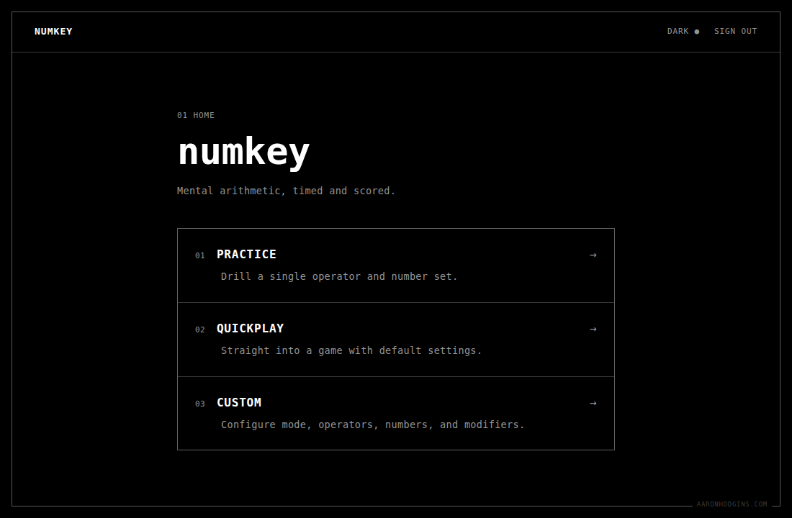
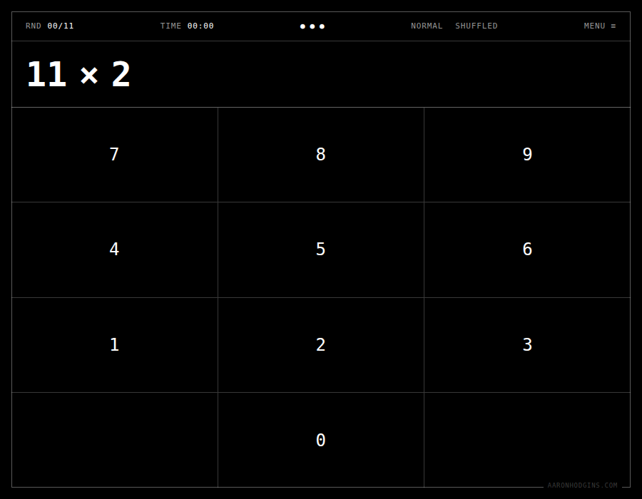
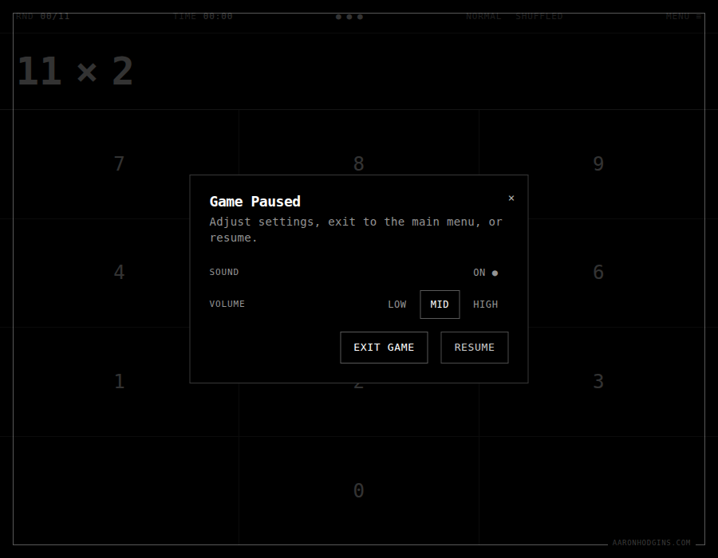
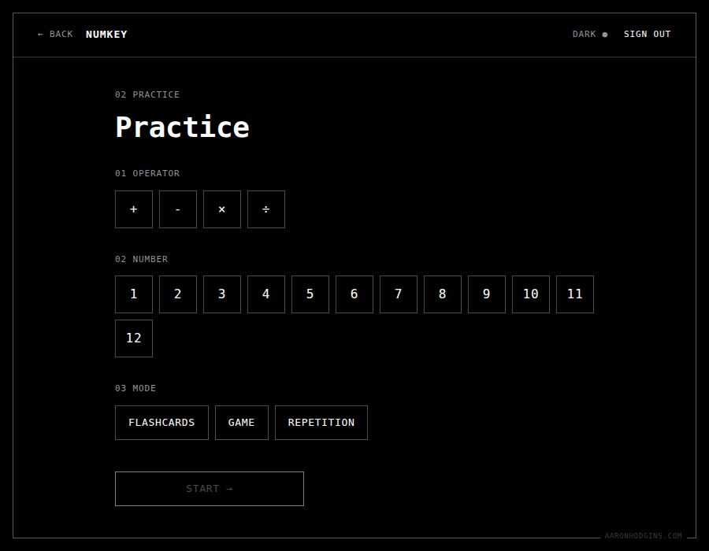
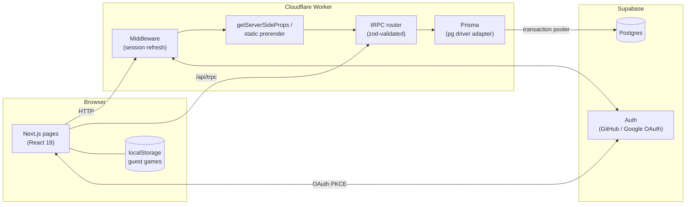
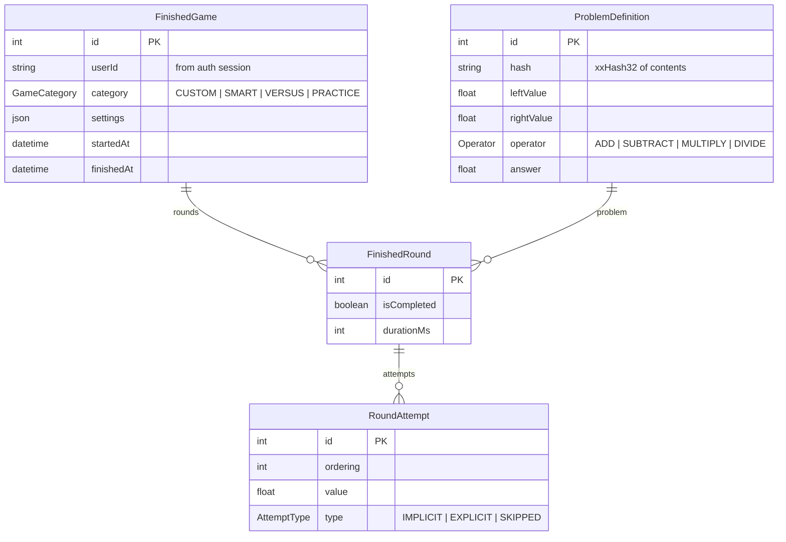

# numkey

[](https://github.com/aaronhod/mathgame/actions/workflows/ci.yml)
[](https://github.com/aaronhod/mathgame/actions/workflows/deploy.yml)

Fast mental-arithmetic game, timed and scored. Full-stack TypeScript —
Next.js + tRPC + Prisma — deployed to Cloudflare Workers, with a
black-and-white monospace design system.

**Play it live: [numkey.aaronhodgins.com](https://numkey.aaronhodgins.com)**



## Features

- **Three ways to play** — Practice (drill one operator and number set),
  QuickPlay (straight into a mixed game), and Custom (pick operators,
  numbers, mode, and modifiers).
- **Game modes and modifiers** — normal, endless, lives, and stack modes;
  shuffled order, randomized operands, and per-problem countdown modifiers.
- **Guest mode** — play without an account; problems are generated in the
  browser and finished games are saved to localStorage.
- **Accounts** — sign in with GitHub or Google (Supabase Auth); finished
  games persist to Postgres with per-round, per-attempt timing.
- **Practice flashcards** — statically prerendered card sets per
  operator/number pair.
- **Feedback synth** — sound effects are generated with the WebAudio API
  (oscillators, no audio assets) with a volume setting persisted per device.
- **Keyboard and touch** — full keyboard play (digits, backspace, sign
  toggle, Escape) alongside an on-screen numpad; Capacitor shells for
  iOS/Android live in `ios/` and `android/`.

| Game | Settings | Practice |
| --- | --- | --- |
|  |  |  |

## Architecture



The app is a Next.js pages-router project compiled for Cloudflare Workers by
the [`@opennextjs/cloudflare`](https://opennext.js.org/cloudflare) adapter.
All server code — SSR, the tRPC API, and auth middleware — runs in a single
Worker at the edge.

**Swappable auth.** `NEXT_PUBLIC_AUTH_PROVIDER` selects the auth backend:
`supabase` (production) uses Supabase Auth with OAuth and cookie sessions;
`basic` (development/CI) is a signed-cookie username/password provider, so
local dev and CI need no external services. Both resolve to the same
`{ userId }` shape consumed by tRPC's `protectedProcedure`.

**Problem identity by content hash.** Problem definitions are seeded into
Postgres once and addressed by an xxHash32 of their contents, so any client
can deterministically ask for "all problems for 7×" without shipping IDs
around.

### Working within Workers' constraints

Two Cloudflare Workers runtime rules shaped the server design (both were
learned the hard way — see the git history):

1. **No runtime WASM compilation.** The runtime rejects
   `WebAssembly.instantiate` from bytes, which rules out `xxhash-wasm`.
   Hashing uses a hand-written pure-TypeScript xxHash32
   (`src/utils/xxh32.ts`) that is verified bit-for-bit against the WASM
   implementation in unit tests, because the hashes are persisted in the
   database and must never drift.
2. **Sockets belong to the request that opened them.** A module-scoped
   Prisma client reuses pooled TCP connections across requests, which the
   runtime kills as hung. `getDb()` (`src/server/db.ts`) returns a fresh
   client per request on Workers and a cached client everywhere else.

## Data model



Games are attributed to the session's `userId` server-side — the client
never supplies one — and reads are scoped to the caller, so numeric IDs
can't be enumerated to see other players' games.

## Getting started

Requires [Bun](https://bun.sh) and Docker (for the local Postgres).

```bash
bun install
bun run db:start     # local Postgres in Docker
bun run db:push      # apply prisma/schema.prisma
bun run db:setup     # seed the problem definitions
bun run dev
```

Sign in with `dev` / `dev` (override with `BASIC_AUTH_USERNAME` /
`BASIC_AUTH_PASSWORD`). Copy `.env.example` to `.env.dev` to customise;
development runs entirely locally with no external accounts.

## Testing

```bash
bun run test         # Vitest unit tests
bun run test:e2e     # Playwright (request-level + browser specs)
bun run typecheck    # tsc --noEmit
bun run lint         # eslint
```

- **Unit tests** cover the game reducer (input, auto-submit, timers), problem
  generation, shuffling (permutation, non-mutation, commutativity guards),
  problem-set parsing, and the xxHash32 implementation, including a
  bit-for-bit parity suite against `xxhash-wasm`.
- **E2E tests** boot the real server against a seeded Postgres and verify the
  practice, flashcard, and login flows at both the HTTP and browser level.
- CI runs unit tests on every push and the full build + typecheck + lint +
  e2e suite on pull requests (`.github/workflows/ci.yml`).

## Deployment

Pushes to `main` build with the OpenNext Cloudflare adapter and deploy to a
Cloudflare Worker via GitHub Actions (`.github/workflows/deploy.yml`).
Auth and Postgres are Supabase; the app connects through the transaction
pooler with `?pgbouncer=true`.

Setup details — environment variables, OAuth provider configuration,
Cloudflare secrets, custom domains — are in
[docs/DEPLOYMENT.md](docs/DEPLOYMENT.md).

## Project structure

```
src/
├── pages/            # Next.js pages router (+ /api/trpc, /api/auth)
├── components/
│   ├── views/        # Game, Display, Numpad, SelectionScreen, reducer
│   ├── layouts/      # Site header (back button, theme, sign-out)
│   └── shad-ui/      # Restyled shadcn/ui primitives
├── game/             # Pure game logic: problems, sets, game instance
├── server/           # tRPC routers, auth resolution, Prisma client
├── utils/            # Hashing, sound synth, storage, API helpers
├── middleware.ts     # Supabase session refresh
└── styles/           # Design system (Tailwind v4)
prisma/               # Schema + problem seeder
e2e/                  # Playwright specs
android/ ios/         # Capacitor shells
```

## License

[MIT](LICENSE)
